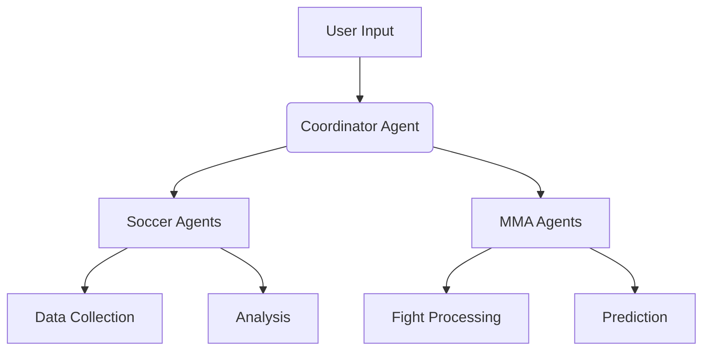

# Sports Analysis Platform - Multi-Agent SDK

## Overview
This platform provides a multi-agent system for analyzing Soccer and MMA data. The agents work together to:
- Collect and process sports data
- Generate insights and predictions
- Coordinate analysis workflows

## Key Components

### Soccer Analysis Agents
- **Data Collector**: Fetches match statistics and player data
- **Tactical Analyzer**: Identifies patterns and strategies
- **Performance Predictor**: Forecasts match outcomes

### MMA Analysis Agents
- **Fight Data Processor**: Analyzes fighter stats and history
- **Style Matcher**: Compares fighting styles
- **Outcome Simulator**: Predicts fight results

## Getting Started

### Prerequisites
- Python 3.8+
- Firebase credentials (for UFC-Oracle)
- Required Python packages (see requirements.txt)

### Installation
```bash
git clone https://github.com/PauloTuppy/-sports-analysis-platform.git
cd -sports-analysis-platform
pip install -r requirements.txt
```

### Running the Agents
```bash
# For Soccer analysis
python llm_agents.py --sport soccer

# For MMA analysis 
python llm_agents.py --sport mma
```

## Architecture


## Contributing
Please see CONTRIBUTING.md for guidelines on how to contribute to this project.

## License
This project is licensed under the MIT License.
